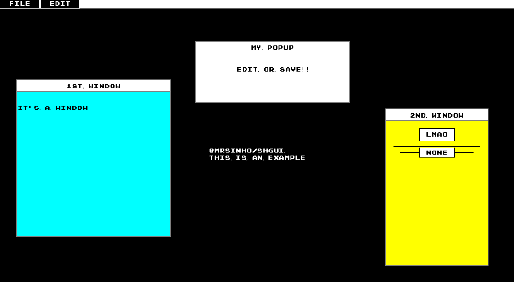

# shgui

A simple and lightweight UI and console system for Vulkan applications written completely in C

* render only characters on screen (font system using txt file)
* make console system --> for custom commands to application, and default commands for UI vars (text, numbers, ecc.)
   e.g. setTextByID, setTextByName, ecc.
* BASTA così, carino e "semplice"

## Build status
[](.shci/linux-log.md)
[](.shci/windows-log.md)



## Features:
* Only two raw widgets available for rendering:
    * regions
        * highlight edge
        * movable
        * input conditions
        * change cursor default icons
    * text

## Build from source
```batch
cd shgui
mkdir build
cd build
cmake .. #-DSH_GUI_BUILD_EXAMPLE=ON
cmake --build .
```

## Binaries and output 
The compiled binaries are located at the [`bin`](/bin) directory.

## Bugs:
* Popup macro system is working, but clicking on the new region messes up priority values

## To do:
* input field --> listen for key inputs, render chars if input field is selected, return string on confirmation
* shGuiRegionColorMatrix / shGuiWindowColorMatrix 
* graphs
* minimize window
* loading bar
* texture loader
* checkbox
* font customization (too much for me, i'm fine with my pixel characters)
