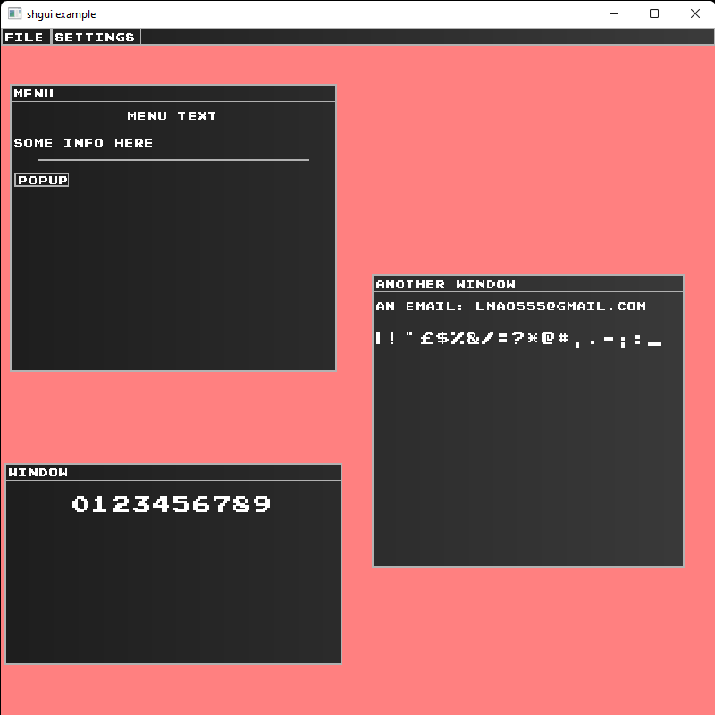

# shgui

## Build status
[](.shci/linux-log.md)
[](.shci/windows-log.md)



## Features:
* Widgets
    * menu bar
        * menu item
    * window
        * highlight edge
        * movable
        * input conditions
        * change cursor default icons
    * text
    * button

## Build from source
```batch
cd shgui
mkdir build
cd build
cmake .. #-DSH_GUI_BUILD_EXAMPLE=ON
cmake --build .
```

## Binaries and output 
The compiled binaries are located at the [`bin`](/bin) directory.

## Issues:
* scaling the UI is ok
* chaging the window size will mess up everything

## To do:
* items rendering priority
* menu popup
* minimize window
* input field
* color picker
* graph
* loading bar
* color matrix
* texture loader
* font customization (too much for me)
